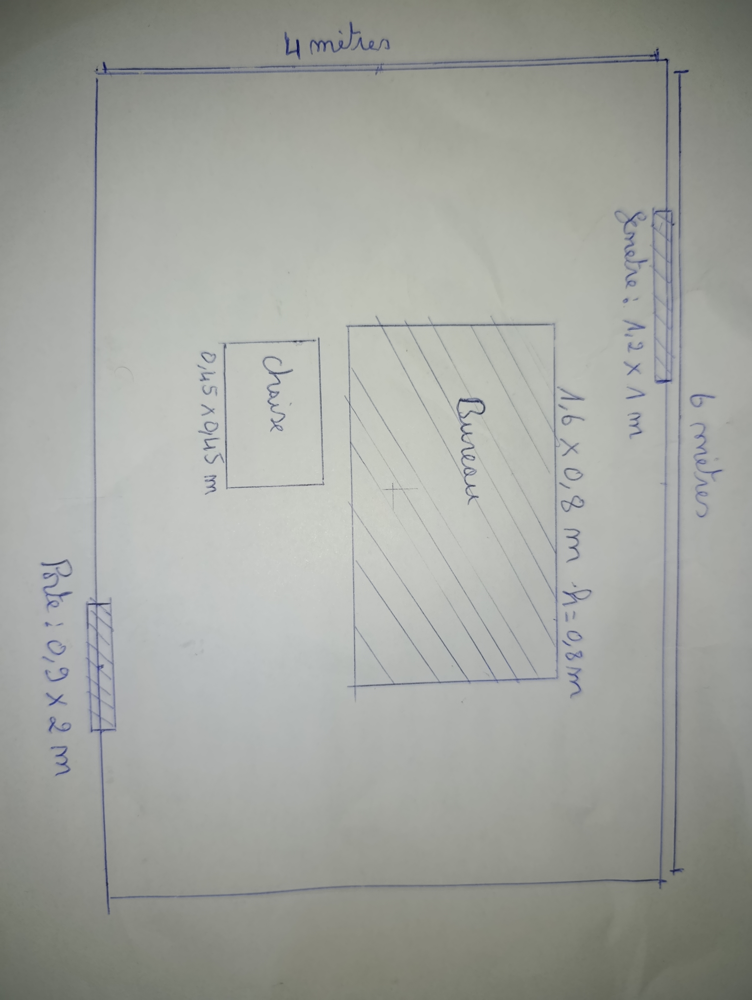

# Enoncer 
Dessinez sur papier la salle que vous construirez tout au long de ce livre. Placez la porte, les fenêtres, une table et ce qui sera posé dessus.

Donnez les dimensions en mètres, pas en unités arbitraires. Une porte fait deux mètres de haut, une table quatre-vingts centimètres. Ces nombres serviront dès le chapitre 7.

## Plan de la salle

Je construis un bureau avec un setup gaming dans une salle rectangulaire de **6,00 m de longueur**, **4,00 m de largeur** et **2,80 m de hauteur**. Elle sera assez grande pour se deplacer confortablement dans l'environnement virtuel.

*Figure 1 : plan de la salle vu du dessus, avec les dimensions en metres.*

### Elements et dimensions

- La **porte** mesure **0,90 m de largeur** et **2,00 m de hauteur**.
- La **fenetre** mesure **1,20 m de largeur** et **1,00 m de hauteur**.
- Le **bureau** mesure **1,60 m de longueur**, **0,80 m de largeur** et **0,80 m de hauteur**.
- Sur le bureau, je poserias un **ecran**, L'**unite centrale** un **clavier** et une **souris**. Les mesures  voir.
- Une **chaise** qui mesure dans les **0,45 m de largeur**, **0,45 m de profondeur** et **0,45 m de hauteur d'assise**.
