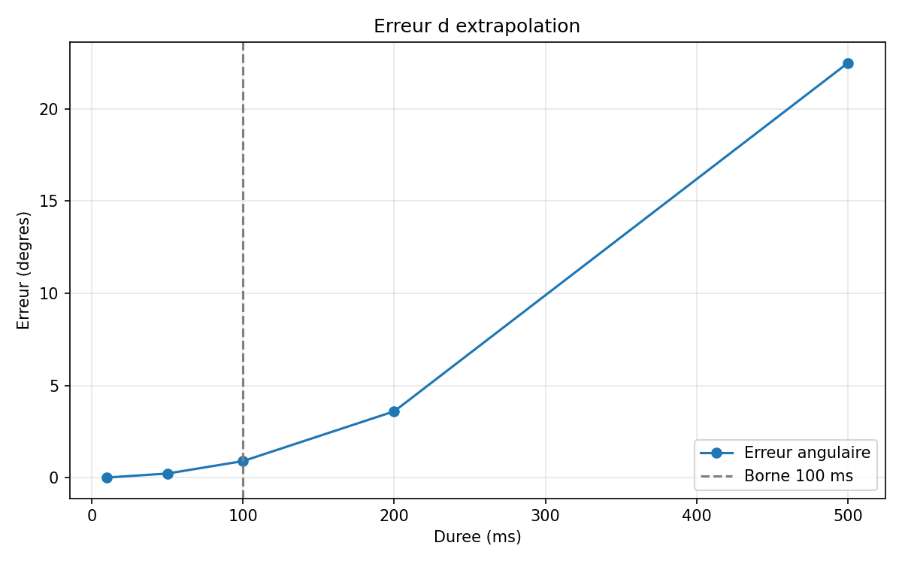

# Exercice 12 : la borne de cent millisecondes

## Énoncé
Extrapolez une pose de tête qui tourne à une vitesse réaliste, disons cent quatre-vingts degrés par seconde, sur des durées croissantes de dix millisecondes à une seconde.

Comparez chaque résultat à la vraie pose, obtenue en simulant le mouvement pas à pas. Rendez la courbe de l'erreur et dites où la borne de cent millisecondes se justifie.
Le programme complet se trouve dans [c2-exo12.cpp](./c2-exo12.cpp).

## Solution
 La vitesse de rotation utilisée est :

 ```text
 180 degrés/s = pi radians/s
 ```

 Pour rendre la comparaison intéressante, j'ai fait une différence entre le
 mouvement prévu et le mouvement réel. L'extrapolation suppose que la tête
 garde sa vitesse initiale de `180 degrés/s`, mais la simulation vraie ajoute
 une accélération de `180 degrés/s²`. La vitesse réelle augmente donc pendant
 le mouvement.

 Pour chaque durée, je calcule deux orientations :

 - l'orientation extrapolée directement avec `angle = vitesse * duree` ;
 - l'orientation vraie en simulant le mouvement accéléré pas à pas, avec un
   pas de `1 ms`.

 Ensuite, je compare les deux quaternions avec leur écart angulaire. Comme les
 quaternions `q` et `-q` représentent la même orientation, je prends la valeur
 absolue de leur produit scalaire avant de calculer l'écart.

## Courbe obtenue

 Le programme affiche une ligne pour chaque durée entre `10 ms` et `1000 ms`.
 Les valeurs principales sont :

 ```text
 Duree             Erreur angulaire
 10 ms             0,009 degre
 50 ms             0,225 degre
 100 ms            0,900 degre
 200 ms            3,600 degre
 500 ms            22,500 degre
 1000 ms           90,000 degre
 ```


Le programme a donc produit une vraie erreur croissante. Plus la durée est
longue, plus l'extrapolation s'éloigne de la pose simulée.

## Pourquoi la borne de 100 ms reste utile

 Dans mon test, à `100 ms`, la tête a déjà commencé à accélérer et l'erreur
 vaut `0,9 degré`. Ce n'est pas encore énorme, mais cela devient visible dans
 un casque si la prédiction est répétée à chaque image.

 À `100 ms`, on est déjà à :

 ```text
 180 degrés/s * 0,1 s = 18 degrés
 ```

 À `1 seconde`, l'erreur atteint `90 degrés`. Le modèle à vitesse constante
 raconte alors vraiment n'importe quoi, parce qu'il ignore complètement le
 changement de vitesse. La borne de `100 ms` évite donc de laisser cette erreur
 devenir trop grande.

## Conclusion

 Cette fois, ma courbe n'est pas plate parce que la vraie tête accélère alors
 que l'extrapolation garde seulement la vitesse de départ. L'erreur est encore
 petite à `10 ms`, elle vaut environ `0,9 degré` à `100 ms`, puis elle devient
 très grande après.

 Pour moi, la borne de `100 ms` se justifie donc bien. Elle laisse une petite
 marge pour prédire le mouvement, mais elle évite de faire confiance trop
 longtemps à une vitesse qui n'est déjà plus correcte. À `100 ms`, l'erreur est
 encore de `0,9 degré`, tandis qu'à une seconde elle atteint `90 degrés`.
 Là, le modèle commence vraiment à raconter n'importe quoi.

## graph

 J'ai fait cinq tests dans le notebook
 [c2-exo12_courbe.ipynb](./c2-exo12_courbe.ipynb), avec des durées de `10`,
 `50`, `100`, `200` et `500 ms`. les résultats sont dans
 [exo12_cinq_tests.csv](./exo12_cinq_tests.csv) et produit le graphe suivant :

 

 Les valeurs enregistrées sont :

 ```text
 duree_ms,erreur_degres
 10,0.0089999999
 50,0.2249999999
 100,0.8999999999
 200,3.5999999999
 500,22.4999999999
 ```

## Fichiers rendus

- Le code : [c2-exo12.cpp](./c2-exo12.cpp)
- Le notebook : [c2-exo12_courbe.ipynb](./c2-exo12_courbe.ipynb)
- Les cinq résultats : [exo12_cinq_tests.csv](./exo12_cinq_tests.csv)
- Le graphe : [exo12_cinq_tests.png](./exo12_cinq_tests.png)
