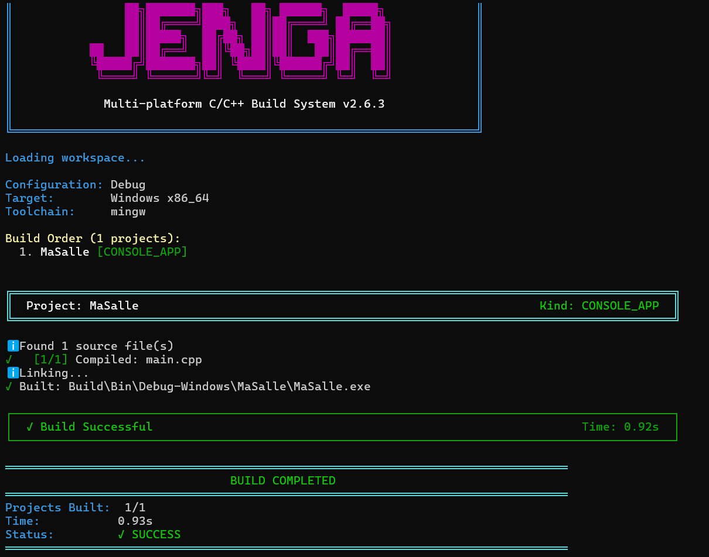

# Exercice 1
## Enoncer
Écrivez le fichier de projet de votre salle et faites-le construire. Le programme n'a rien à faire : une fonction main qui rend zéro suffit.

Rendez le fichier et la sortie de jenga build.

## Solution

Après avoir créer le WorkSpace `Salle` et le projet `MaSalle` à l'intérieur, j'ai lancé :
```text
jenga build
```

et la sortie obtenue est :



## Conclusion et remarque
* Le build est réussi : le fichier `main.cpp` est compilé et l'exécutable est
produit dans `Build\Bin\Debug-Windows\MaSalle\MaSalle.exe`.

Le programme ne fait rien, la seule chose est de  construire correctement et de retourner zéro.

## Code
Les fihiers .jenga et .cpp sont dans le même dossier au nom de :  [salle.jenga](salle.jenga) et  [main.cpp](main.cpp).
