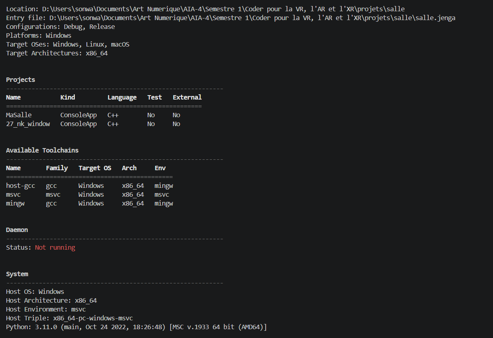

# Exercice 13

## Énoncé

Lancez `jenga info -v` et rendez le tableau `Available Toolchains` en entier.

Dites ce qui est présent sur votre machine et ce qui manque.

## Solution

### Commande utilisée

```powershell
jenga info -v
```

### Available Toolchains



| Name     | Family | Target OS | Arch   | Env   |
| -------- | ------ | --------- | ------ | ----- |
| host-gcc | gcc    | Windows   | x86_64 | mingw |
| msvc     | msvc   | Windows   | x86_64 | msvc  |
| mingw    | gcc    | Windows   | x86_64 | mingw |

### Ce qui est présent sur ma machine

Les toolchains disponibles détectées par Jenga sur ma machine sont :

* `host-gcc`
* `msvc`
* `mingw`

Elles sont toutes détectées pour Windows en architecture `x86_64`.

### Ce qui manque

La commande `jenga info -v` ne fournit pas directement une liste des toolchains manquantes. Elle affiche uniquement les toolchains que Jenga détecte comme disponibles.

Cependant, la documentation et le dépôt GitHub du projet Jenga présentent d'autres toolchains qui peuvent être détectées ou utilisées selon l'environnement, par exemple `android-ndk`, `emscripten`, `zig`, `clang-mingw`, `clang-native` et `clang-cl`.

Ces toolchains n'apparaissent pas dans mon tableau `Available Toolchains`. Elles ne sont donc pas détectées comme disponibles sur ma machine actuellement.

### Conclusion
Les toolchains disponibles détectées par Jenga sont `host-gcc`, `msvc` et `mingw`. La commande ne fournit pas, dans ce tableau, une liste explicite des toolchains manquantes.

En comparant avec les autres toolchains présentées dans le dépôt GitHub de Jenga, certaines comme `android-ndk`, `emscripten`, `zig` ou certaines variantes de `clang` ne sont pas détectées sur ma machine actuellement.
