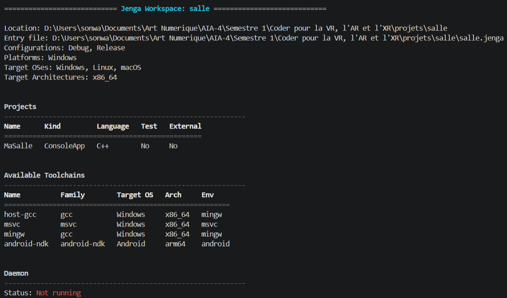
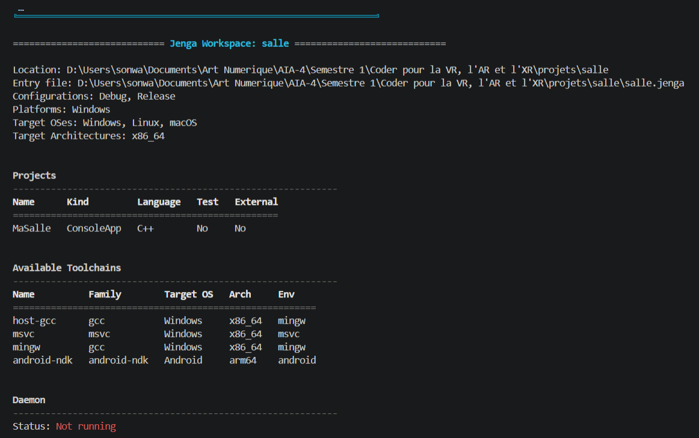
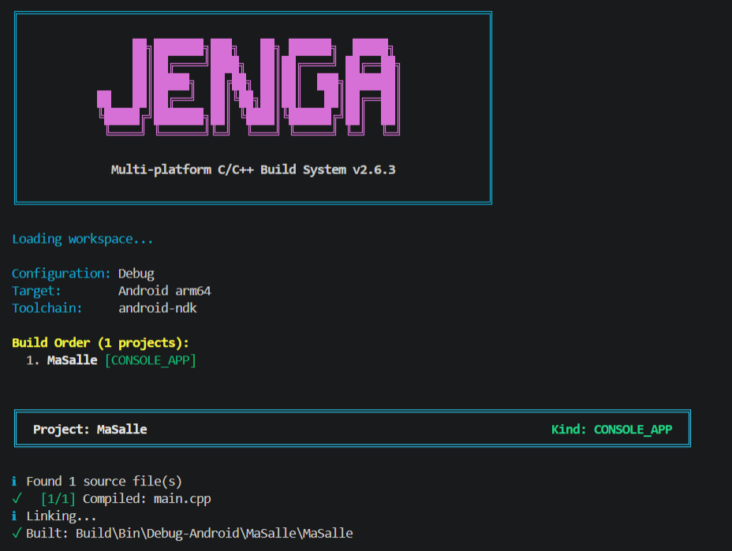

# Exercice 14

## Énoncé

Ajoutez à votre fichier de projet le filtre pour Android, avec ses bibliothèques et ses définitions.

Commencez par constater que `jenga info` ne vous apprendra rien ici : sa sortie est la même que la condition du filtre soit vraie ou fausse. Montrez-le, c'est la première moitié de la réponse.

Puis dites, en une phrase, comment vous vérifieriez qu'il s'active bien pour Android. Cherchez du côté des commandes qui prennent un `--platform`.

## Solution

### Ajout du filtre Android

J'ai ajouté dans mon fichier [salle.jenga](salle.jenga) un filtre pour Android après avoir installer `android ndk` :

```python
with filter("system:Android"):
    usetoolchain("android-ndk")
    defines(["ANDROID"])
    links(["EGL", "GLESv3", "android", "log"])
```

Le filtre utilise la toolchain `android-ndk`, ajoute la définition `ANDROID` et les bibliothèques nécessaires.

### Vérification avec `jenga info`

* la sortie est avant : 

* la sortie est avant : 


La sortie reste la même que le filtre Android soit présent ou non.

Cela montre que `jenga info` ne permet pas de vérifier directement si le filtre est actif pour une plateforme donnée.

### Vérification avec `--platform`

Pour vérifier que le filtre s'active bien pour Android, j'ai lancé :

```powershell
jenga build --platform android-arm64
```

Cette fois, Jenga indique :


L'exécutable Android a été généré dans :

```text
Build\Bin\Debug-Android\MaSalle\MaSalle
```

### Conclusion

La commande `jenga info` ne permet pas de vérifier directement l'activation du filtre Android. En revanche, avec `jenga build --platform android-arm64`, Jenga utilise bien la toolchain `android-ndk` et le projet `MaSalle` est compilé avec succès pour Android ARM64.
