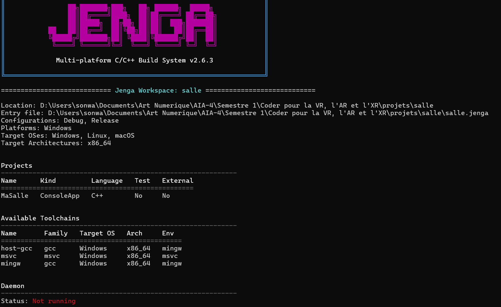

# Exercice 2
## Enoncer
Lancez jenga info sur votre projet et lisez sa sortie en entier. Rendez-la, et dites ce qu'elle vous apprend que le fichier de projet ne disait pas explicitement.

## Solution
J'ai gardé le même projet qu'a l'exercice 1 et je lance :
```text
jenga info
```

et la sortie obtenue est :


## Conclusion et remarque
La commande `jenga info` confirme que 
* le workspace s'appelle `salle`
* Jenga utilise bien le fichier `salle.jenga`. Elle * configurations disponibles, `Debug` et `Release`, 
* la plateforme actuellement détectée : Windows en architecture `x86_64`.

Le fichier de projet déclarait les configurations et le langage C++, mais la
commande révèle d'autre informations comme :
- les systèmes d'exploitation ciblé sont Windows, Linux et macOS ;
- l'architecture cible est `x86_64` ;
- trois toolchains sont disponibles : `host-gcc`, `msvc` et `mingw` ;
- `MaSalle` n'est ni une suite de tests ni un projet externe ;
- le daemon Jenga n'est pas lancé.

donc `jenga info` permet notament de vérifier le workspace chargé, les cibles
disponibles et les compilateurs utilisables

