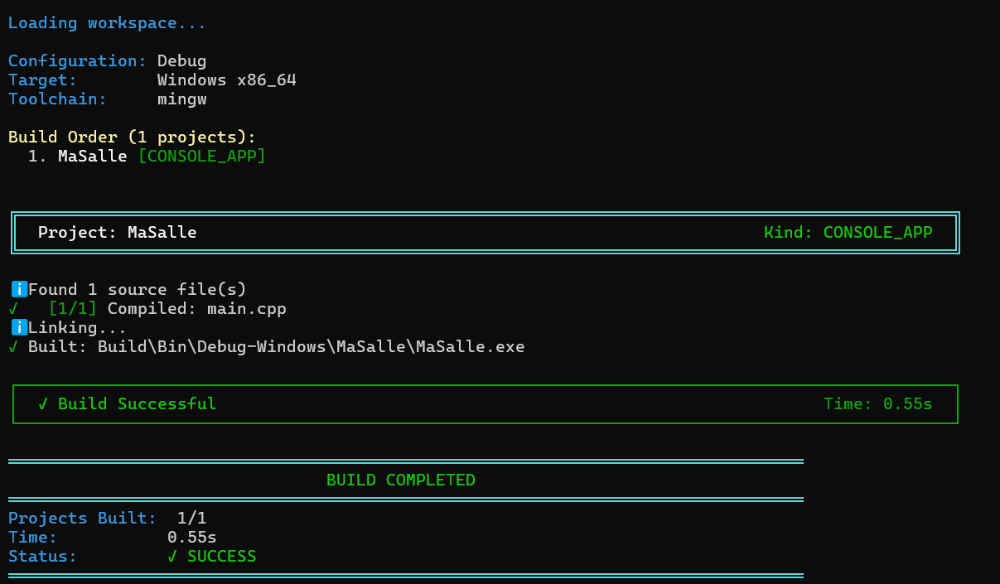
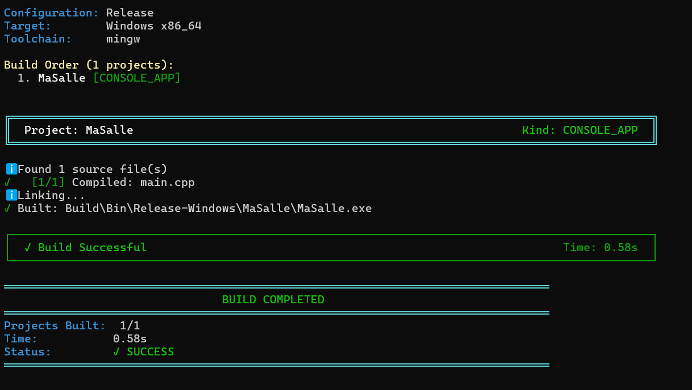

# Exercice 3
## Enoncer
Construisez votre projet en Debug puis en Release. Comparez la taille des deux exécutables et le temps de construction.

Rendez les quatre nombres.

## Solution
J'ai gardé le même projet qu'a l'exercice 1 et je lance et étant donné que par défaut la configuration est en `debug` j'ai lancé:
### Debug
```text
jenga build --config Debug
```
et la sortie obtenue est :

### Release
```text
jenga build --config Release
```
et la sortie obtenue est :


## tableau
| Configuration | Taille de l'exécutable | Temps de construction |
|---|---:|---:|
| Debug | 54 ko | 0,55 s |
| Release | 54ko | 0,58 s |

## Conclusion et remarque
On constate que les deux exécutables ont la même taille, soit 54 Ko. Par contre, le temps de construction en Release est légèrement plus élevé qu'en Debug.

Le mode Debug et le mode Release donnent ici des résultats assez proches pour ce petit projet. La différence de temps de construction est très faible.