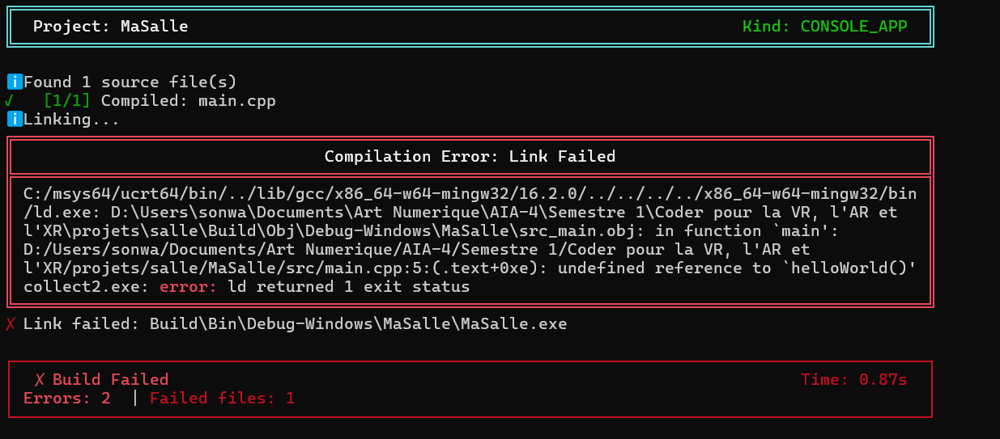

# Exercice 4
## Enoncer
Ajoutez à votre projet un module qui dépend lui-même d'un autre, puis retirez ce second de votre liste.

Rendez le message d'erreur exact, en entier, et dites à laquelle des quatre étapes de la chaîne de construction il appartient : préprocesseur, compilation, assemblage, ou édition de liens.

## Solution

J'ai deux fichiers dans le dossier src :
- `main.cpp`, qui appelle la fonction helloWorld() ;
- `helloworld.cpp`, qui contient la définition de la fonction helloWorld().

J'ai ensuite retiré helloworld.cpp de la liste des fichiers utilisés pour la construction du projet, tout en gardant son appel dans main.cpp dans le fichier [salle.jenga](salle.jenga) : `files(["src/main.cpp", "include/**.hpp"])`.
J'ai lancé la construction avec: 
```text
jenga build
```
et la sortie obtenue est :



## Analyse et remarque
L'erreur appartient à l'étape d'édition de liens.

On le voit notamment avec les lignes :
```
undefined reference to `helloWorld()'
```
main.cpp appelle bien la fonction helloWorld(), mais helloworld.cpp, qui contient sa définition, n'a pas été inclus dans la construction. Le compilateur arrive donc à compiler main.cpp, mais l'éditeur de liens ne trouve pas l'implémentation de helloWorld() lorsqu'il doit créer l'exécutable.

L'erreur se produit donc à l'étape édition de liens, et non pendant le préprocesseur, la compilation ou l'assemblage.
