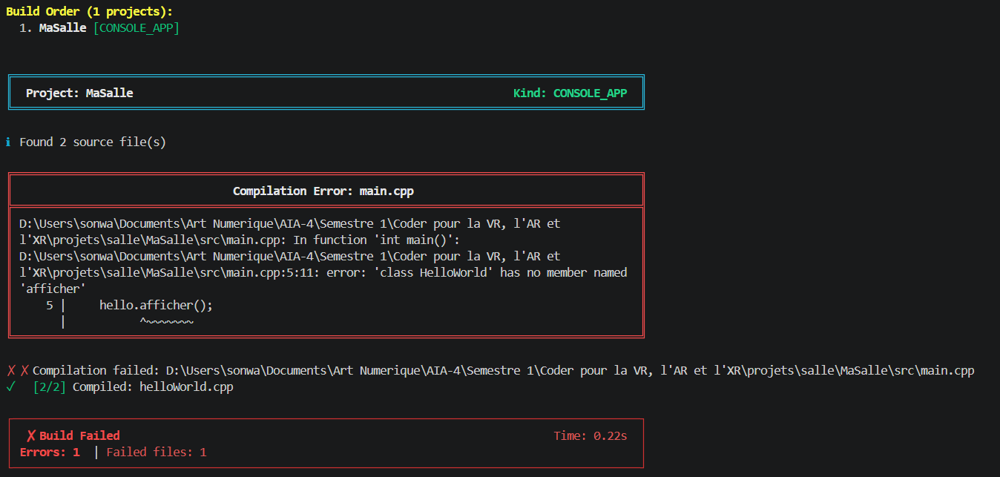

# Exercice 5

## Énoncé

Écrivez un petit en-tête à vous qui déclare une classe complète si un define est posé, et une coquille vide sinon. Compilez un programme qui l'emploie, avec puis sans le define. Rendez les deux messages et dites lequel des deux vous auriez su diagnostiquer sans cet exercice.

## Solution

Pour cet exercice, j'ai utilisé une classe `HelloWorld` avec une méthode `afficher()`.

- [HelloWorld.hpp](HelloWorld.hpp) : Lorsque `HELLO_WORLD` est défini, la classe contient la méthode `afficher()`. Sinon, la classe est vide.

- [HelloWorld.cpp](helloWorld.cpp)

- [main.cpp](main.cpp)

Dans le fichier [salle.jenga](salle.jenga), j'ai ajouté le dossier `include` et le define :

```python
with project("MaSalle"):
    consoleapp()
    language("C++")
    location("MaSalle")
    files(["src/**.cpp", "include/**.hpp"])
    includedirs(["include"])
    defines(["HELLO_WORLD"])
```

### 1. Compilation avec le define

Avec :

```python
defines(["HELLO_WORLD"])
```

la classe contient bien la méthode `afficher()`.

La compilation se termine donc correctement et le programme peut utiliser cette méthode.

### 2. Compilation sans le define

J'ai ensuite retiré temporairement :

```python
defines(["HELLO_WORLD"])
```

et relancé la compilation.

J'ai obtenu le message suivant :


Cette erreur est normale car sans le define `HELLO_WORLD`, la classe `HelloWorld` est vide. La méthode `afficher()` n'existe donc pas.

## Remarque
Avec le define `HELLO_WORLD`, la classe `HelloWorld` est complète et le programme peut utiliser la méthode `afficher()`. Sans le define, la classe devient vide et le compilateur signale que la méthode `afficher()` n'existe pas.

## Conclusion
L'erreur obtenue sans le define est celle que j'aurais pu diagnostiquer sans cet exercice, car le message indique directement que la classe `HelloWorld` ne possède pas la méthode `afficher()`. L'exercice m'a surtout permis de comprendre le lien entre le define et le contenu de la classe.