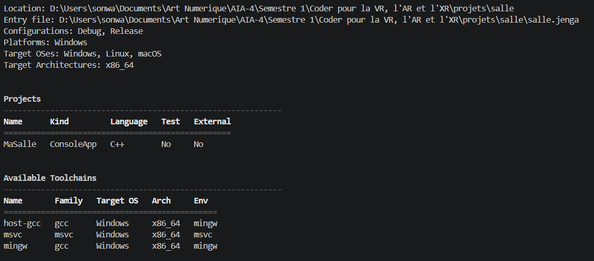
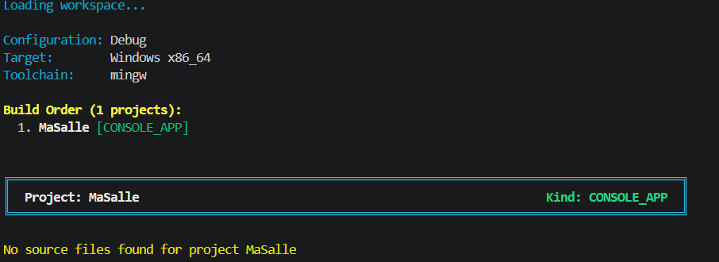

# Exercice 9

## Énoncé

Ajoutez à `files` un motif qui ne correspond à aucun fichier, et à `includedirs` un dossier qui n'existe pas.

Rendez ce que `jenga info` en dit, et ce que `jenga build` en dit. Comparez les deux : lequel vous aurait fait gagner du temps ?

## Solution

J'ai ajouté dans mon fichier `salle.jenga` un fichier qui n'existe pas dans `files` et un dossier qui n'existe pas dans `includedirs`.

```python
with project("MaSalle"):
    consoleapp()
    language("C++")
    location("MaSalle")
    files(["src/AIA.cpp", "include/**.hpp"])
    includedirs(["include", "AIA4"])
```

Ensuite, j'ai lancé la commande :

```bash
jenga info
```


`jenga info` permet de voir les informations générales du projet, mais il ne signale pas forcément directement que le fichier ou le dossier ajouté n'existe pas.

J'ai ensuite lancé :

```bash
jenga build
```


Cette commande vérifie réellement les fichiers nécessaires à la construction du projet. Elle permet donc de voir plus clairement le problème causé par le chemin qui n'existe pas.

## Comparaison

Entre les deux commandes, **`jenga build` m'aurait fait gagner plus de temps**, parce qu'il permet de détecter directement le problème lors de la construction du projet.

`jenga info` sert surtout à avoir une vue générale de la configuration du projet, tandis que `jenga build` permet de vérifier concrètement si le projet peut être construit.

## Conclusion

Cela montre qu'un chemin incorrect peut ne pas être évident avec `jenga info`. Pour vérifier rapidement si les fichiers et les dossiers utilisés par le projet sont valides, `jenga build` est donc plus pratique.
