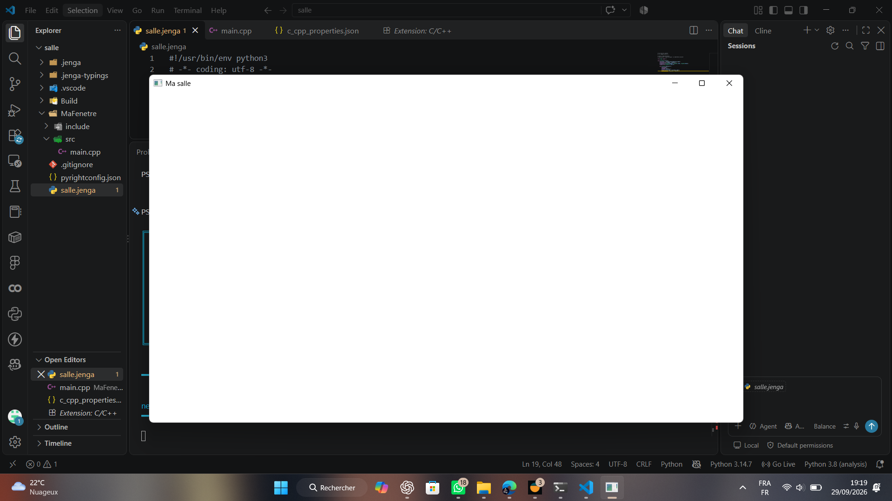

# Exercice 1 : La fenêtre nue

## Énoncé

> Écrivez le programme de quinze lignes de ce chapitre, construisez-le avec Jenga, et lancez-le.
>
> Rendez le fichier `.jenga` et une capture de la fenêtre. Dites combien de temps cela vous a pris, honnêtement : ce nombre vous servira de référence pour mesurer vos progrès.

## Solution
Pour réaliser cet exercice, j'ai créé le projet `MaFenetre` avec Jenga et utilisé le kit `KitNkentseu`. Les modules `NKWindow` et `NKEvent` ont été utilisés pour créer la fenêtre et gérer les événements.

Le programme crée une fenêtre appelée **« Ma salle »**, avec une largeur de **1280 pixels** et une hauteur de **720 pixels**. Il vérifie ensuite que la fenêtre est valide. Tant que la fenêtre est ouverte, les événements sont traités avec `NkEvents().PollEvents()`.

### Programme [`main.cpp`](main.cpp)

```cpp
nkentseu::NkWindowConfig config;

config.title = "Ma salle";
config.width = 1280;
config.height = 720;

nkentseu::NkWindow fenetre(config);

if (!fenetre.IsValid()){
    return 1;
}

while (fenetre.IsOpen()){
    nkentseu::NkEvents().PollEvents();
}
```

### Fichier [`salle.jenga`](salle.jenga)

Le projet `MaFenetre` est configuré avec le kit `KitNkentseu` :

```python
from Jenga import *

with workspace("salle"):
    useconfig("../KitNkentseu/KitNkentseu.jenga")
    configurations(['Debug', 'Release'])
    targetoses([TargetOS.WINDOWS, TargetOS.LINUX, TargetOS.MACOS])
    targetarchs([TargetArch.X86_64])

    with project("MaFenetre"):
        consoleapp()
        language("C++")
        location("MaFenetre")
        files(["src/**.cpp", "include/**.hpp"])
        usekitnkentseu(["NKWindow", "NKEvent"])
```

### Construction et lancement
J'ai construit le programme avec la commande :
```powershell
jenga build
```

La compilation s'est terminée avec succès, puis j'ai lancé le programme et vérifié que la fenêtre **« Ma salle »** s'affiche correctement.

### Capture de la fenêtre


### Temps réalisé

**Temps de codage : environs 4 min 37 s.**
Pour mesurer le temps nécessaire à l'écriture du `main.cpp`, j'ai utilisé le chronomètre de mon téléphone. Je l'ai lancé au début du travail et arrêté une fois la saisie terminer.