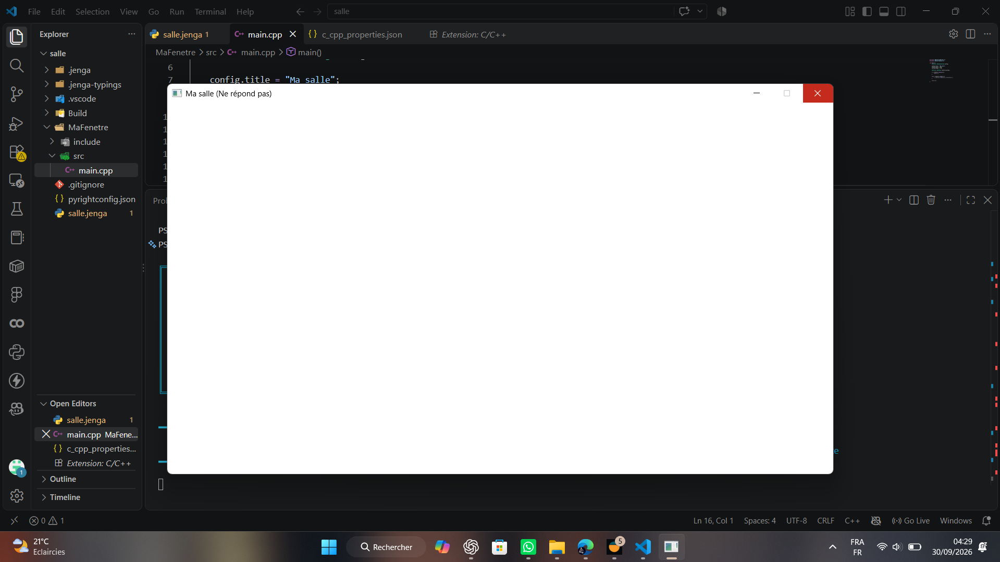

# Exercice 2 : La fenêtre qui ne répond pas

## Énoncé

> Remplacez le corps de la boucle par un commentaire, de façon à ne plus appeler `PollEvents`.
>
> Lancez, attendez, et rendez une capture du moment où le système déclare la fenêtre bloquée. Chronométrez au bout de combien de secondes cela arrive sur votre machine.

## Solution

J'ai repris le programme de l'exercice précédent et j'ai modifié le corps de la boucle `while` afin de ne plus appeler `PollEvents()`.

### Programme [`main.cpp`](main.cpp)

```cpp
while (fenetre.IsOpen()){
    // NkEvents().PollEvents();
}

```

### Construction et lancement

J'ai construit le programme avec Jenga :

```powershell
jenga build
```

La compilation s'est terminée avec succès. J'ai ensuite lancé le programme et attendu que le système détecte que la fenêtre ne répond plus.

### Mesure du temps

Pour mesurer le temps, j'ai utilisé le **chronomètre de mon téléphone**. Je l'ai lancé au moment où j'ai démarré le programme et arrêté lorsque le système a indiqué que la fenêtre était bloquée:  `Ma salle (ne répond pas)`.

**Temps mesuré : 5.60 s**

### Capture d'écran



### Observation

Sans l'appel à `PollEvents()`, les événements de la fenêtre ne sont plus traités. La fenêtre finit donc par être considérée comme ne répondant plus par le système.

Sur ma machine, cela s'est produit après environ 5,60 secondes. Le temps peut être différent sur une autre machine, car il dépend notamment du système et de la manière dont celui-ci détecte qu'une application ne répond plus.